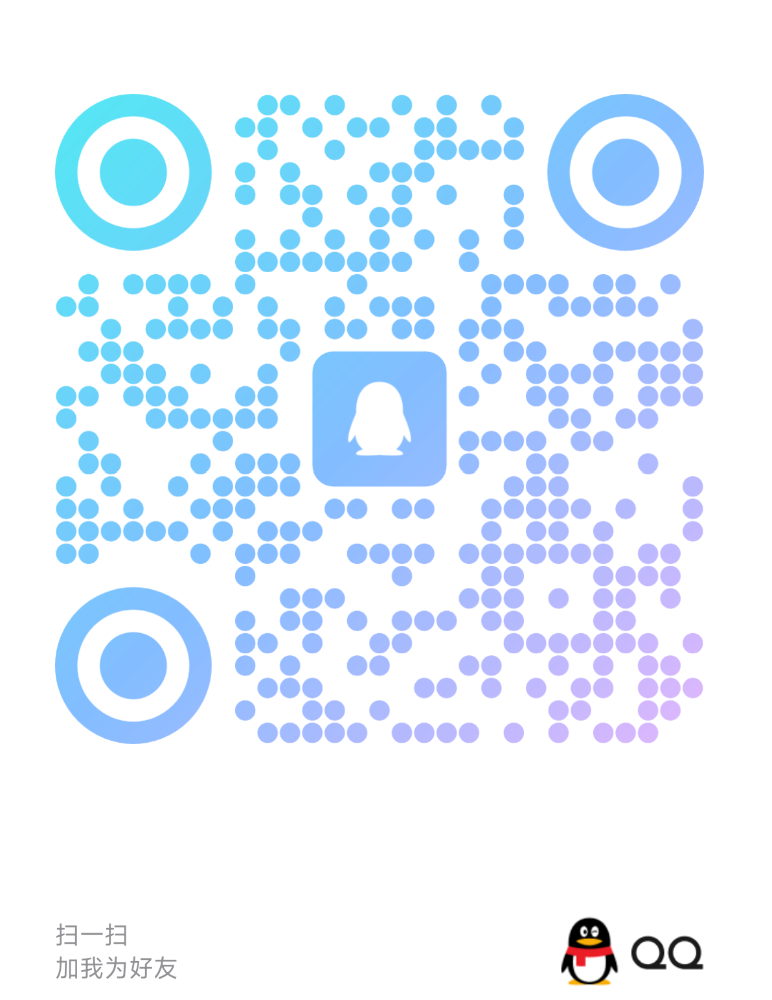

<div align="center">

# Vela — AI Novel Writing IDE

**The next-generation AI-powered novel & fiction writing IDE for web novel authors, indie writers and creative professionals.**

[](https://reactjs.org/)
[](https://www.electronjs.org/)
[](https://www.typescriptlang.org/)
[](https://github.com/Kimcop-kc/vela/actions/workflows/build-windows.yml)
[](https://github.com/Kimcop-kc/vela/releases/latest)
[](https://github.com/Kimcop-kc/vela/releases)
[](https://opensource.org/licenses/GPL-3.0)
[](#installation)

### ⬇️ [**Download the latest Vela**](https://github.com/Kimcop-kc/vela/releases/latest) — macOS (Apple Silicon / Intel) · Windows x64

[Read in Chinese (中文)](README.md) | [Read in Russian (Русский)](README_RU.md)

[Installation](#installation) | [Key Features](#key-features) | [Model Configuration](#model-configuration) | [📝 Changelog](CHANGELOG.md) | [💬 Contact](#-feedback--contact) | [🌟 Recommended API: Fluxion AI](#fluxion-ai)

</div>

> 💡 **No API key yet?** Try [Fluxion AI](https://fluxionai.space/register?source=github&campaign=vela&promo=VELA) — one entry point to access and manage leading global AI models. OpenAI-compatible, works with Vela out of the box, **$3 free credit on signup**. 👉 [Claim now](https://fluxionai.space/register?source=github&campaign=vela&promo=VELA)

---

> **Vela** is an open-source, privacy-first, local-first AI writing IDE purpose-built for **novel writing**, **web fiction**, and **creative writing**. It deeply integrates LLM-powered workflows (outline generation, chapter drafting, intelligent rewriting, automated review) with a local RAG knowledge base, giving authors an IDE-level immersive creative experience — all running on your own machine with your own API keys (BYOK).

---

## Screenshots

||
|:---:|
|*Immersive writing workspace with side-by-side AI panel, IDE-grade window management*|

||
|:---:|
|*End-to-end AI novel writing pipeline: from worldbuilding to chapter generation*|

<details>
<summary><b>More Screenshots</b></summary>
<br>


<br/><br/>

<br/><br/>

<br/><br/>


</details>

---

## Key Features

Vela is not just another chat-based text editor — it is a **production-grade novel writing engine** that deeply integrates LLM capabilities, long-context retrieval (RAG), and automated pipelines for fiction authoring.

### AI-Powered Novel Writing Pipeline

| Capability | Description |
|---|---|
| Worldbuilding | Custom global world settings, core plot axes, character profiles (with cross-chapter dynamic state tracking) |
| Auto Outline | One-click AI generation of "structural skeleton → chapter outlines → scene/emotion/rhythm requirements", supports Three-Act, Hero's Journey and other narrative structures |
| Chapter Drafting | Single-chapter streaming generation, accurately responding to prior context and preset outlines, can be stopped at any time |
| AI Rewrite | Supports paragraph-level or full-chapter rewriting while maintaining character and plot consistency |
| Refine | AI automatically detects grammar errors, typos, and logic gaps, outputting polished suggestions |
| Review | AI evaluates chapters from a reader/editor perspective, identifying pacing, character arc, and foreshadowing issues |
| Triple Post-Process Pipeline | Rewrite → Refine → Review three-stage chain ensuring high-quality chapter output |

### Million-Word Local RAG Knowledge Base

| Capability | Description |
|---|---|
| Bulk Import | One-click import of millions of words of reference novels, world settings documents, character setting collections |
| Vector Semantic Search | Automatically recalls the most relevant setting chunks based on current chapter semantics — say goodbye to character/setting inconsistencies |
| Pure Local Storage | Built-in SQLite + lightweight vector engine, all data stored locally, works offline |

### Extensible Architecture

| Capability | Description |
|---|---|
| BYOK (Bring Your Own Key) | Natively compatible with OpenAI, DeepSeek, Gemini, Claude, Ollama (local offline), Zhipu GLM, etc. Smart routing: use DeepSeek for outlines, Claude for polishing, local models for privacy review |
| MCP Protocol | Native Model Context Protocol integration, attach custom tool servers to extend AI capabilities |
| Usage Analytics | Built-in statistics panel for LLM calls, token consumption, and cost trends |

### IDE-Grade Productivity UI

| Capability | Description |
|---|---|
| Resizable Panels | File tree + editor + AI panel + bottom terminal, flexible combination like VSCode/JetBrains |
| Dark Theme | Optimized dark mode with custom floating title bar and status bar micro-interactions |
| Keyboard Shortcuts | Global shortcuts: Cmd+N new, Cmd+O open, Cmd+=/- zoom |
| Cross-Platform | macOS (dmg) / Windows (nsis) / Linux (AppImage) |

---

## Installation

### Direct Download

Go to [Releases](https://github.com/Kimcop-kc/vela/releases) to download the latest version for your OS:

| Platform | Installer | Notes |
|---|---|---|
| macOS (Apple Silicon M1/M2/M3/M4) | `Vela-<version>-macOS-arm64-Installer.dmg` | For Apple Silicon Macs |
| macOS (Intel) | `Vela-<version>-macOS-x64-Installer.dmg` | For Intel Macs |
| Windows x64 | `Vela-<version>-Windows-x64-Setup.exe` | Installer, custom install folder supported |
| Windows x64 | `Vela-<version>-Windows-x64-Portable.exe` | Portable, just double-click |

#### 🍎 macOS Installation (Important)

The macOS builds are **not code-signed or notarized with an Apple Developer certificate**, so macOS blocks the first launch. This is expected — do the following once:

1. **Pick the right build**: Apple menu → "About This Mac", check the "Chip" / "Processor" row:
   - Apple M1 / M2 / M3 / M4 → download the `macOS-arm64` dmg
   - Intel → download the `macOS-x64` dmg
2. Open the `.dmg` and drag **Vela** into your **Applications** folder.
3. **Do not double-click on the first launch**: open Applications, **right-click (or Control-click) Vela → Open**, then click **Open** in the dialog.
4. If macOS says *"Vela is damaged and can't be opened"* or *"cannot verify the developer"*, open **Terminal** and run:

   ```bash
   sudo xattr -dr com.apple.quarantine /Applications/Vela.app
   ```

   Enter your login password (it stays invisible while typing), then launch Vela again.
5. Alternatively, click "OK" on the warning, then go to **System Settings → Privacy & Security**, scroll to the bottom and click **Open Anyway** for Vela.

> You only need to do this **once** — afterwards Vela launches like any other app.

#### 🪟 Windows Installation

The Windows builds are unsigned as well. If the blue "Windows protected your PC" dialog appears, click **More info → Run anyway**.

### Build from Source

```bash
# Requirements: Node.js >= 20 (LTS recommended)

# 1. Clone the project
git clone https://github.com/Kimcop-kc/vela.git
cd vela

# 2. Install dependencies
npm install

# 3. Start dev server (with hot reload)
npm run dev

# 4. Build for distribution
npm run build
```

> **Note**: You need build tools for native SQLite modules (macOS: Xcode Command Line Tools, Windows: Visual Studio Build Tools).

---

## Model Configuration

Vela supports multiple mainstream LLM providers. Quick setup:

1. Open the app → click **Settings** in the bottom-left
2. Go to **Model Configuration**
3. Click **Add Model**:
   - Select provider: OpenAI / DeepSeek / Gemini / Ollama / Zhipu / Custom
   - Fill in `API Key` and `Base URL` (if using a proxy)
   - Assign recommended models for different tasks (writing / polishing / Embedding retrieval)
4. **Start writing!**

**Supported LLM Providers:**

`OpenAI` · `DeepSeek` · `Google Gemini` · `Anthropic Claude` · `Ollama (Local)` · `Zhipu GLM` · `MiniMax` · `SiliconFlow` · `Fluxion AI (Recommended)` · `Any OpenAI-compatible API`

> 💡 **Recommended:** if you don't have an official key or want to cut costs, use [Fluxion AI](https://fluxionai.space/register?source=github&campaign=vela&promo=VELA) (OpenAI-compatible). In step 3 above choose "Custom / OpenAI-compatible" and fill in your Fluxion AI `Base URL` + `API Key`. Get **$3** free credit on signup.

---

<span id="fluxion-ai"></span>

## 🌟 Recommended: Fluxion AI — One Entry Point for Leading Global AI Models

Fluxion AI serves indie developers, tech teams and enterprises with a unified API to access and manage leading global AI models. Multi-route dynamic scheduling improves availability, with transparent model performance, latency and billing. When using Fable 5.1, Fluxion AI can save up to ~90% vs. official Claude API pricing.

- ✅ **Unified OpenAI-Compatible API**, works with Vela out of the box
- 🔀 **Multi-route dynamic scheduling** for higher availability
- 📊 **Transparent model performance, latency and costs**
- 🎁 **Get $3 API credit on signup**

👉 **Exclusive link: [Sign up and claim $3 credit](https://fluxionai.space/register?source=github&campaign=vela&promo=VELA)**

<a href="https://fluxionai.space/register?source=github&campaign=vela&promo=VELA" target="_blank">
  
</a>

---

## Sponsor

Vela's open-source edition is driven by passion in spare time. If this tool has improved your writing efficiency or you see its commercial potential, feel free to sponsor! Your support is my biggest motivation to keep iterating.

---

## Tech Stack

| Layer | Technology |
|---|---|
| **UI Framework** | React 19 + TypeScript + Zustand |
| **Styling** | Tailwind CSS v4 + Radix UI + Lucide Icons |
| **Desktop** | Electron 41 + Vite 8 |
| **Local Storage** | better-sqlite3 (relational) + Lightweight vector engine (RAG) |
| **IPC** | Type-safe IPC channels |
| **AI Integration** | OpenAI-compatible + Gemini Protocol + MCP |

---

## Contributing

We welcome community contributions, including but not limited to:
- Bug fixes
- New AI provider adapters
- UI/UX improvements
- Internationalization (i18n) translations
- Documentation improvements

> For major feature refactors, please discuss with the author first in [Issues](https://github.com/Kimcop-kc/vela/issues) to avoid direction conflicts.

---

## 💬 Feedback & Contact

Found a bug, have an idea, or just want to talk about writing? Reach out:

- 🐛 **Bugs / feature requests**: please open an [Issue](https://github.com/Kimcop-kc/vela/issues) first — it keeps things trackable and searchable for everyone.
- 💬 **WeChat / QQ**: scan the QR codes below (please mention "Vela" when adding).

| WeChat | QQ |
|:---:|:---:|
|  |  |

### ☕ If you find it useful, you can buy me a coffee

Vela is free and keeps getting updates. If it has genuinely saved you time, feel free to scan the code below ❤️


---

## License

This project is licensed under [GPL-3.0 License](LICENSE). You are free to run, study, share, and modify the code, but new software based on this modified distribution **must also be open-sourced under GPL-3.0**.

For closed-source commercial licensing, please contact the author via email.

---

<div align="center">

*Vela — Your AI-powered novel writing companion. Write smarter, not harder.*

</div>

<!--
  SEO Keywords:
  AI novel writing, AI writer, novel writing tool, fiction writing software,
  web novel, creative writing IDE, AI story generator, novel outline generator,
  RAG knowledge base, LLM writing assistant, Electron writing app,
  open source writing tool, DeepSeek writing, Claude writing, BYOK AI
-->
